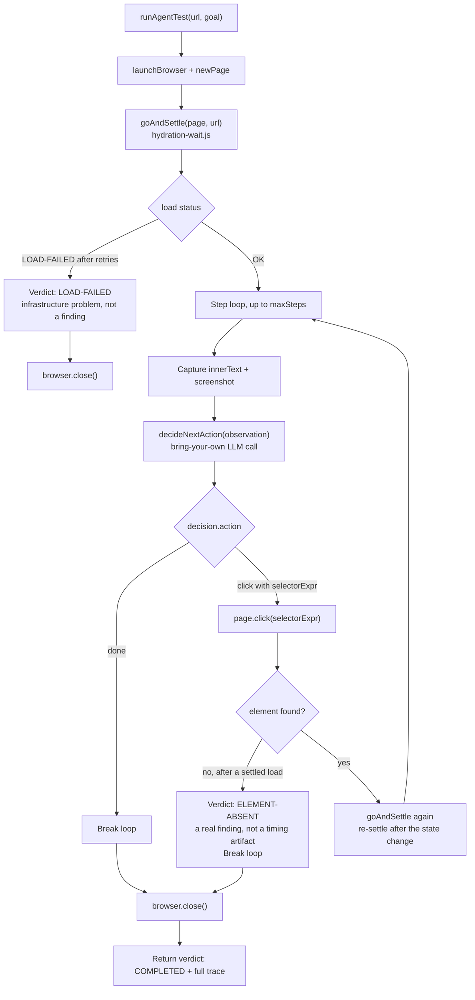

# AI-Agentic QA Framework

[](https://github.com/daud-khan-qa/ai-agentic-qa-framework/actions/workflows/ci.yml)
[](package.json)
[](#license)

A lightweight, zero-dependency framework for running AI-agent-driven browser QA against production SaaS applications - the pattern behind a platform I architected that manages 2,500+ automated test cases across a 19-product SaaS ecosystem.

## Why this exists

Most browser QA still relies on brittle, hand-written locators and fixed sleeps. This framework flips that: an AI agent (LLM) is handed structured page state and decides what action to take next, step by step, the same way a human tester would explore an unfamiliar page - but it needs *reliable* ground truth to reason over, or it hallucinates results.

That reliability problem - not the AI integration - is the hard part. This repo demonstrates the patterns that make agent-driven QA trustworthy instead of a random-failure generator.

## Core problems this solves

### 1. SPA hydration is not "page load"
Modern single-page apps report `DOMContentLoaded` seconds before their content is actually interactive. A fixed `sleep(3000)` either wastes time on fast loads or returns empty captures on slow ones - in production testing this alone accounted for a meaningful share of false "test failed" results before the fix.

`src/hydration-wait.js` implements a **poll-until-stable** pattern: it watches `document.body.innerText.length`, waits for it to stop changing across consecutive samples, and retries the whole navigation (via an `about:blank` bounce to force a clean SPA remount) up to N times before giving up and reporting a real load failure - not a false negative.

### 2. Zero-dependency browser control
`src/cdp-driver.js` drives Chrome directly over the Chrome DevTools Protocol using only Node's native `fetch` and `WebSocket` - no Playwright, no Puppeteer install required. Useful for constrained environments, quick diagnostic scripts, or agent sandboxes where adding a full automation framework as a dependency isn't worth it.

### 3. Screenshots as ground truth, not text scraping alone
Text-based DOM scraping misses hover-only tooltips, canvas-rendered content, and can silently mis-report a broken page as "empty" rather than "broken." `src/agent-test-runner.js` captures a screenshot alongside every text extraction so an agent (or a human reviewer) can visually confirm a finding before it's reported as a defect.

### 4. Verdict discipline
The runner distinguishes **LOAD-FAILED** (the page never became interactive - an infrastructure/test problem) from **ELEMENT-ABSENT** (the page loaded fine, the thing you're looking for genuinely isn't there - a real finding). Conflating these two is the single most common cause of noisy, untrustworthy AI QA output.

## The observe-act-verify loop

Traced directly against `runAgentTest()` in `src/agent-test-runner.js` - this is the actual control flow, including where verdict discipline (point 4 above) gets enforced.



The critical branch is `L`: an element not found is only ever reported as `ELEMENT-ABSENT` *after* `goAndSettle` has already confirmed the page is fully hydrated. Checking for an element before that point is exactly the false-negative pattern point 1 above exists to prevent - `runAgentTest` never does it.

## Zero-dependency browser control

```js
const { launchBrowser } = require('./src/cdp-driver');
const { goAndSettle } = require('./src/hydration-wait');

const browser = await launchBrowser();
const page = await browser.newPage();

// Reliable load: bounces through about:blank, retries up to 4x,
// only returns once content length is stable across 3 consecutive polls
const result = await goAndSettle(page, 'https://demo-saas.example.com/billing');

if (result.status === 'LOAD-FAILED') {
  console.log('Infrastructure issue - not a product finding');
} else {
  const shot = await page.screenshot();
  const text = await page.evaluate(() => document.body.innerText);
  // hand `text` + `shot` to an LLM agent for the next decision
}
```

## Structure

```
src/
  cdp-driver.js          Minimal CDP driver: launch, connect, evaluate JS, screenshot, click
  hydration-wait.js       Reliable page-settle detection with bounded retry
  agent-test-runner.js    Wires the driver + settle logic into an
                          agent-consumable "observe -> act -> verify" loop
test/
  hydration-wait.test.js  Unit tests with injectable timing (see CI)
```

## Real-world results (sanitized)

Applied against a 19-product production SaaS platform:
- 2,500+ test cases managed across 5 repositories / 13 microservices
- Root-cause audit distinguished genuine product defects from infrastructure noise: found that the large majority of "failures" in a naive setup were platform/rate-limit conditions, not product bugs, once verdict discipline (above) was applied
- Eliminated an entire class of false-positive ("false green") tests caused by clicking before hydration completed

## What I'd build next

- Pluggable LLM backend (currently agent-agnostic by design - bring your own model call)
- Baseline diffing for front-end findings (spelling, layout, placeholder leakage) so repeat runs report only *new* issues, not the same 500 findings every night
- Structured finding schema (Tool, Field, Issue, Impact, Fix) for direct hand-off into a ticketing system

## Relationship to my other repos

- [`agentic-safety-patterns`](https://github.com/daud-khan-qa/agentic-safety-patterns) - what happens after this framework finds something: precision-gated auto-action, fail-closed data integrity
- [`e2e-test-suite-patterns`](https://github.com/daud-khan-qa/e2e-test-suite-patterns) - the hand-authored, peer-reviewed E2E side of the same work

## License

**All rights reserved.** This repository is shared publicly for portfolio and demonstration purposes only. No license is granted to copy, modify, or redistribute this code without my permission.

---
Built and used in production QA architecture, 2025-2026. Code here is a generalized, sanitized version - no proprietary endpoints, credentials, or business logic included.
